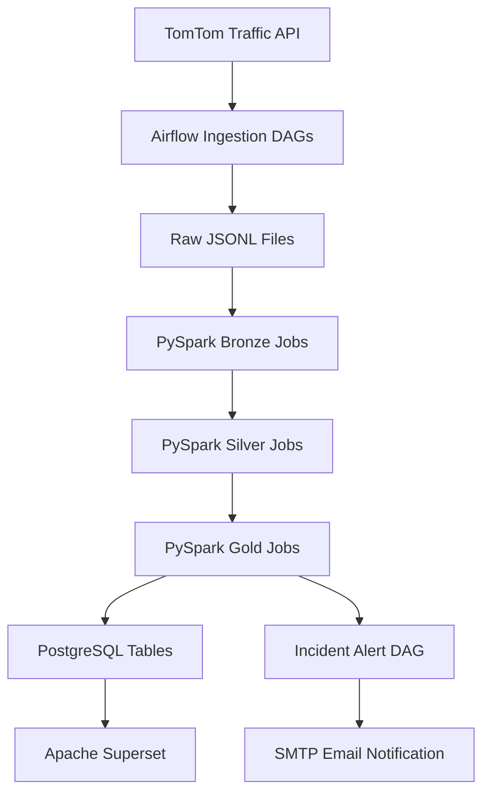
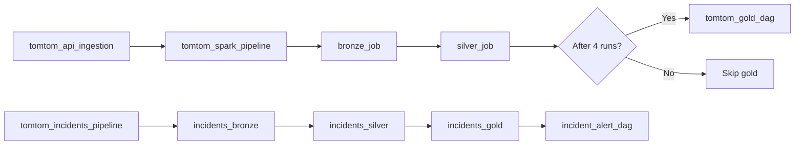

# Smart City Traffic ETL Pipeline

This repository implements a containerized, reproducible data engineering pipeline for ingesting, transforming, storing, and visualizing traffic flow and incident data for three German cities: Berlin, Bremen, and Frankfurt. The implementation is built around Apache Airflow for orchestration, Apache Spark for distributed processing, PostgreSQL for analytics storage, Superset for visualization, Docker Compose for local deployment, and Terraform for AWS infrastructure provisioning.

The project was implemented as a thesis-style data engineering solution with three explicit research objectives:

- Reproducibility: containerization and infrastructure automation improve deployment consistency.
- Resilience: Airflow retries, task dependencies, and trigger-based recovery improve operational robustness.
- Reusability: a standardized intermediate schema and city-driven configuration enable reuse across multiple urban areas.

## Table of Contents

1. [Project Overview](#1-project-overview)
   - [High-Level Architecture](#high-level-architecture)
   - [Main Objectives](#main-objectives)
2. [System Architecture](#2-system-architecture)
   - [Component Responsibilities](#component-responsibilities)
   - [End-to-End Data Flow](#end-to-end-data-flow)
3. [Technology Stack](#3-technology-stack)
4. [Repository Structure](#4-repository-structure)
   - [Key Files and Responsibilities](#key-files-and-responsibilities)
5. [Data Source Documentation](#5-data-source-documentation)
6. [Data Ingestion Process](#6-data-ingestion-process)
7. [Data Organization and Storage](#7-data-organization-and-storage)
8. [Data Schema Documentation](#8-data-schema-documentation)
9. [Schema Mapping and Multi-City Reusability](#9-schema-mapping-and-multi-city-reusability)
10. [Apache Airflow Orchestration](#10-apache-airflow-orchestration)
11. [Pipeline Execution Flow](#11-pipeline-execution-flow)
12. [Resilience and Self-Healing Mechanisms](#12-resilience-and-self-healing-mechanisms)
13. [Email Alert Configuration](#13-email-alert-configuration)
14. [Apache Spark Processing](#14-apache-spark-processing)
15. [Spark Memory Management](#15-spark-memory-management)
16. [Docker Containerization](#16-docker-containerization)
17. [Terraform Infrastructure Deployment](#17-terraform-infrastructure-deployment)
18. [Installation Guide](#18-installation-guide)
19. [Running the Pipeline](#19-running-the-pipeline)
20. [Evaluation Against the Research Questions](#20-evaluation-against-the-research-questions)
21. [Future Improvements](#21-future-improvements)
22. [Notes](#notes)
---

## 1. Project Overview

The system collects traffic data from the TomTom Traffic API and transforms it through a medallion-style pipeline:

- Raw data is stored in JSONL files.
- Spark jobs convert raw files into bronze, silver, and gold datasets.
- Analytical outputs are loaded into PostgreSQL for reporting and dashboarding.
- Airflow orchestrates ingestion, transformation, and alerting workflows.

The pipeline is designed for near-real-time ingestion and batch-oriented processing. In the current repository implementation, ingestion and transformations are scheduled around 15-minute intervals for the ingestion tasks, while Spark-based transformations are triggered by Airflow DAG dependencies.

### High-level architecture



### Main objectives

- Collect city-level traffic flow and incident observations.
- Standardize and enrich data through Spark transformations.
- Persist analytical outputs in PostgreSQL.
- Provide a reproducible deployment path using Docker and Terraform.
- Support resilience through retries, task dependencies, and alerting.

---

## 2. System Architecture

The repository follows a layered ETL architecture.

### Component responsibilities

- TomTom API: source of traffic flow and incident data.
- Airflow DAGs: orchestrate data collection, Spark execution, and alert flows.
- Spark jobs: implement bronze/silver/gold processing.
- PostgreSQL: stores operational logs, pipeline metrics, traffic KPIs, incident data, and point-level traffic observations.
- Superset: provides a dashboarding layer for visual exploration of the analytical tables.
- Docker Compose: runs the full local stack with Airflow, Spark, PostgreSQL, and Superset.
- Terraform: provisions an AWS EC2 environment for deploying the same stack remotely.

### End-to-end data flow

1. Airflow fetches traffic flow and incident data from TomTom.
2. Raw JSONL records are written to the runtime data directory.
3. Spark reads the raw files and writes bronze Parquet data.
4. Spark cleans, normalizes, deduplicates, and enriches the data into silver Parquet data.
5. Spark aggregates the latest batch into gold data and writes it to PostgreSQL.
6. Superset reads the analytical tables and can be used for dashboards and exploration.
7. The incident alert DAG queries the latest severe incidents and sends email notifications when relevant rows are detected.

---

## 3. Technology Stack

| Technology | Purpose | Role in the System |
| --- | --- | --- |
| Python | Application logic | Implements Airflow DAG helper functions and Spark job orchestration logic |
| Apache Airflow | Workflow orchestration | Runs ingestion, Spark transformation, and alerting DAGs |
| Apache Spark / PySpark | Distributed data processing | Executes bronze, silver, and gold transformations |
| PostgreSQL | Analytical database | Stores KPIs, incidents, metrics, and logs |
| Docker | Containerization | Packages the application stack into reproducible services |
| Docker Compose | Multi-service orchestration | Starts Airflow, Spark, PostgreSQL, and Superset together |
| Terraform | Infrastructure automation | Provisions AWS EC2 infrastructure for deployment |
| AWS EC2 | Cloud runtime | Hosts the deployed ETL stack |
| Apache Superset | Data visualization | Provides dashboarding on the analytical tables |
| TomTom Traffic API | External data source | Supplies traffic flow and incident observations |

---

## 4. Repository Structure

The repository contains the following top-level layout:

```text
smart-city-traffic-etl/
├── dags/                  # Airflow DAG definitions and shared helpers
├── spark/                 # PySpark transformation jobs
├── utils/                 # SQL initialization scripts and database bootstrapping
├── terraform/             # AWS Terraform deployment files
├── scripts/               # EC2 bootstrap script for AWS deployment
├── superset/              # Superset container image and sample chart assets
├── data/                  # Runtime data directory (raw, bronze, silver, gold)
├── docker-compose.yml     # Local container orchestration definition
├── Dockerfile             # Airflow image definition
├── .env.example           # Environment template
└── README.md              # Project documentation
```

### Key files and responsibilities

| Path | Purpose | Input | Output |
| --- | --- | --- | --- |
| [dags/tomtom_ingestion_api_dag.py](dags/tomtom_ingestion_api_dag.py) | Ingests traffic flow data and triggers downstream processing | TomTom flow API, city config | Raw JSONL files and downstream DAG trigger |
| [dags/tomtom_incidents_pipeline_dag.py](dags/tomtom_incidents_pipeline_dag.py) | Ingests incident data and triggers incident processing | TomTom incident API, city config | Raw incident JSONL files and downstream Spark jobs |
| [dags/tomtom_spark_pipeline_dag.py](dags/tomtom_spark_pipeline_dag.py) | Runs the flow bronze/silver Spark jobs and triggers gold processing | Bronze/silver data paths | Spark transformation execution and gold DAG trigger |
| [dags/tomtom_gold_dag.py](dags/tomtom_gold_dag.py) | Executes the traffic gold job | Silver flow data | PostgreSQL KPIs and Parquet gold output |
| [dags/incident_alert_dag.py](dags/incident_alert_dag.py) | Queries severe incidents and sends email alerts | PostgreSQL `traffic_incidents` table | Email notification |
| [dags/common/config.py](dags/common/config.py) | Central configuration for cities, API endpoint, and DB settings | Environment variables | Reusable config for DAGs and helpers |
| [dags/common/extract.py](dags/common/extract.py) | Builds request grids and calls TomTom endpoints | City bounding boxes, API key | JSON payloads for ingestion |
| [dags/common/paths.py](dags/common/paths.py) | Defines runtime directories | None | Paths used by the ETL tasks |
| [spark/bronze_job.py](spark/bronze_job.py) | Converts flow JSONL into bronze Parquet | Raw flow JSONL | Bronze Parquet data |
| [spark/silver_job.py](spark/silver_job.py) | Cleans and enriches flow data | Bronze flow Parquet | Silver Parquet data |
| [spark/gold_job.py](spark/gold_job.py) | Aggregates flow data into KPIs and writes to PostgreSQL | Silver flow Parquet | Gold Parquet and `traffic_kpis`/`traffic_points` tables |
| [spark/incidents_bronze.py](spark/incidents_bronze.py) | Converts incident JSONL into bronze Parquet | Raw incident JSONL | Bronze incident Parquet |
| [spark/incidents_silver.py](spark/incidents_silver.py) | Normalizes incident timestamps and fields | Bronze incident Parquet | Silver incident Parquet |
| [spark/incidents_gold.py](spark/incidents_gold.py) | Loads incident data into PostgreSQL | Silver incident Parquet | `traffic_incidents` table |
| [utils/init.sql](utils/init.sql) | Creates the PostgreSQL schema | Empty database | Tables for logs, KPIs, points, incidents, and metrics |
| [terraform/main.tf](terraform/main.tf) | Provisions the AWS EC2 host | Terraform variables | EC2 instance |
| [terraform/security.tf](terraform/security.tf) | Opens required network ports | None | Security group rules |
| [scripts/user_data.sh](scripts/user_data.sh) | Bootstraps the server with Docker and the application | EC2 instance | Deployable runtime environment |

---

## 5. Data Source Documentation

The repository ingests data from the TomTom Traffic API.

### What the source provides

- Traffic flow data: current speed, free-flow speed, current travel time, road class, confidence, and road closure information.
- Incident data: location, category, severity-related metadata, delay, and road names.

### API authentication

The code expects a TomTom API key from the environment variable `TOMTOM_API_KEY`.

The request logic is implemented in [dags/common/extract.py](dags/common/extract.py):

- Flow data uses the TomTom Flow Segment API endpoint.
- Incident data uses the TomTom Incident Details API endpoint.

### How to obtain and configure the API key

1. Create a TomTom developer account.
2. Create or select an application in the developer portal.
3. Generate an API key.
4. Store it in the runtime environment file `.env` (based on [.env.example](.env.example)).

The repository does not hardcode the API key. It is read at runtime from the environment, which is the recommended approach for secrets management and deployment reproducibility.

### Environment configuration

The environment template [.env.example](.env.example) contains variables for:

- PostgreSQL credentials: `PG_USER`, `PG_PASSWORD`, `PG_DB`
- TomTom API key: `TOMTOM_API_KEY`
- Airflow admin credentials
- Superset admin credentials
- SMTP settings for alerting

The compose file also expects Airflow security values for `AIRFLOW__CORE__FERNET_KEY` and `AIRFLOW__WEBSERVER__SECRET_KEY` because Airflow uses them for secure configuration and web session handling. These values should be supplied in the host environment or `.env` file before deployment.

---

## 6. Data Ingestion Process

### Traffic flow ingestion

The DAG [dags/tomtom_ingestion_api_dag.py](dags/tomtom_ingestion_api_dag.py) is the entry point for flow data ingestion.

It performs the following steps:

1. Loads city configuration from [dags/common/config.py](dags/common/config.py).
2. Builds a spatial grid around each city bounding box.
3. Calls the TomTom flow API for each grid point.
4. Writes one JSONL file per city and batch timestamp into the raw data directory.

### Incident ingestion

The DAG [dags/tomtom_incidents_pipeline_dag.py](dags/tomtom_incidents_pipeline_dag.py) handles incident ingestion.

It performs the following steps:

1. Loads city bounding boxes.
2. Calls the incident endpoint once per city configuration.
3. Writes incident records to JSONL files under the raw incidents directory.
4. Triggers the Spark incident processing jobs.

### Ingestion parameters

The implementation uses:

- City-level bounding boxes for Berlin, Bremen, and Frankfurt.
- A grid step count per city to generate multiple sample points.
- A batch timestamp derived from Airflow execution time.
- A fixed collection cadence of every 15 minutes for the ingestion DAGs.

### Raw data storage

Raw data is written under the runtime path `/opt/data` inside the container. In the repository, this is mapped to the local [data](data) folder for persistence.

The main raw directories are:

- [data/raw](data/raw): flow JSONL files
- [data/raw_incidents](data/raw_incidents): incident JSONL files

---

## 7. Data Organization and Storage

The pipeline uses a directory structure that is consistent with a medallion-style data lake.

```text
data/
├── raw/                  # Raw flow JSONL files
├── raw_incidents/        # Raw incident JSONL files
├── bronze/               # Bronze Parquet data
├── silver/               # Silver Parquet data
├── gold/                 # Gold Parquet and analytical outputs
```

### Partitioning strategy

The Spark jobs write Parquet data partitioned by:

- `city`
- `date`

This makes the data structure suitable for city-based filtering and date-based historical analysis.

### Data organization principles

- Raw files preserve the ingestion batch.
- Bronze files store the latest batch in a schema-defined Parquet layout.
- Silver files enrich the data and remove duplicate or invalid records.
- Gold files materialize the analytical output used in PostgreSQL and dashboards.

This organization supports both operational observability and analytical reuse.

---

## 8. Data Schema Documentation

### A. Traffic flow schema

The raw ingestion step maps the TomTom flow payload into the following record structure:

| Field | Description | Source |
| --- | --- | --- |
| `city` | City name | Ingestion configuration |
| `batch_ts` | Airflow batch timestamp | Ingestion context |
| `lat` | Latitude of sampled point | Grid generation |
| `lon` | Longitude of sampled point | Grid generation |
| `frc` | Road class value | TomTom flow payload |
| `current_speed` | Current observed speed | TomTom flow payload |
| `free_flow_speed` | Ideal condition speed | TomTom flow payload |
| `travel_time` | Current travel time | TomTom flow payload |
| `confidence` | Confidence score | TomTom flow payload |
| `road_closure` | Closure flag | TomTom flow payload |

### Engineered features in Spark

The Spark flow jobs derive additional features for analysis:

| Feature | Calculation | Purpose |
| --- | --- | --- |
| `road_id` | Hash of `city`, `lat`, `lon`, and `frc` | Creates a stable road segment identifier |
| `speed_ratio` | `current_speed / free_flow_speed` | Measures congestion relative to free-flow performance |
| `processed_at` | Current timestamp | Captures data processing time |
| `date` | Parsed from `batch_ts` | Enables date-based partitioning |
| `congestion_level` | Rule-based classification from speed ratio | Supports dashboard categorization |
| `delay_seconds` | `current_travel_time - free_flow_travel_time` | Measures delay impact |
| `congestion_percent` | Ratio of congested segments to total segments | Supports aggregated monitoring |

### B. Incident schema

The incident ingestion step maps the API payload into the following record structure:

| Field | Description | Source |
| --- | --- | --- |
| `city` | City name | Ingestion configuration |
| `batch_ts` | Airflow batch timestamp | Ingestion context |
| `incident_type` | Type of incident | TomTom incident payload |
| `category` | Numeric incident category | TomTom incident payload |
| `lat` | Latitude | Incident geometry |
| `lon` | Longitude | Incident geometry |
| `delay_seconds` | Incident delay | TomTom properties |
| `road_numbers` | Serialised road numbers | TomTom properties |
| `from_road` | Source road | TomTom properties |
| `to_road` | Destination road | TomTom properties |
| `start_time` | Incident start | TomTom properties |
| `end_time` | Incident end | TomTom properties |

### Engineered incident features

The incident silver and gold jobs add:

- `observed_at`: timestamp derived from the batch timestamp
- `start_time` and `end_time` converted to timestamp types
- `processed_at`: timestamp from Spark processing
- `date`: date derived from the batch timestamp

---

## 9. Schema Mapping and Multi-City Reusability

A key design requirement of the project is reusability. The implementation supports this through a configuration-driven approach.

### How reusability is implemented

- The city-specific configuration is stored centrally in [dags/common/config.py](dags/common/config.py).
- The ingestion logic uses a common schema format regardless of city.
- The Spark transformations operate on the same intermediate schema for all cities.
- A new city can be added by introducing a new bounding box and grid configuration without changing the core transformation logic.

### Workflow for adding a new city

1. Add a new city entry in the configuration file.
2. Define its bounding box and grid steps.
3. Reuse the existing ingestion and Spark transformation code.
4. The pipeline writes data to the same bronze/silver/gold structure.

This satisfies the reusability objective expressed in the project’s research question by keeping the processing logic city-agnostic while keeping the input context configurable.

---

## 10. Apache Airflow Orchestration

Airflow is the control plane of the system.

### DAG summary

| DAG | File | Purpose | Schedule |
| --- | --- | --- | --- |
| `tomtom_api_ingestion` | [dags/tomtom_ingestion_api_dag.py](dags/tomtom_ingestion_api_dag.py) | Fetches flow data for each city and triggers the Spark pipeline | Every 15 minutes |
| `tomtom_spark_pipeline` | [dags/tomtom_spark_pipeline_dag.py](dags/tomtom_spark_pipeline_dag.py) | Runs bronze and silver Spark jobs and conditionally triggers gold processing | Manual/triggered |
| `tomtom_incidents_pipeline` | [dags/tomtom_incidents_pipeline_dag.py](dags/tomtom_incidents_pipeline_dag.py) | Fetches incidents, runs incident Spark jobs, and triggers alerts | Every 15 minutes |
| `incident_alert_dag` | [dags/incident_alert_dag.py](dags/incident_alert_dag.py) | Reads severe incidents and sends email alerts | Manual/triggered |
| `tomtom_gold_dag` | [dags/tomtom_gold_dag.py](dags/tomtom_gold_dag.py) | Executes the flow gold Spark job | Manual/triggered |

### DAG relationships

- The ingestion DAG triggers the flow Spark pipeline.
- The Spark pipeline runs bronze and silver processing and then, after every fourth run, triggers the gold DAG.
- The incident ingestion DAG runs incident bronze/silver/gold processing and then triggers the incident alert DAG.

### Airflow behavior

The DAG definitions use:

- `catchup=False`
- `max_active_runs=1` on the ingestion DAGs
- `retries=3` and `retry_delay=2 minutes` from [dags/common/config.py](dags/common/config.py)
- `TriggerDagRunOperator` for downstream orchestration
- `BranchPythonOperator` to decide whether to trigger the gold DAG

### Airflow workflow diagram



---

## 11. Pipeline Execution Flow

The execution lifecycle is as follows:

1. Airflow starts the ingestion DAG.
2. Raw flow or incident JSONL files are created.
3. Spark jobs process the new batch.
4. Bronze, silver, and gold datasets are written to the local or container-mounted data directories.
5. Gold results are loaded into PostgreSQL tables.
6. Incident processing can trigger an alert DAG for severe incidents.

### Manual and scheduled execution

- Scheduled execution is configured through Airflow DAG schedules.
- Manual execution is possible through the Airflow UI by triggering the DAGs directly.
- The Spark pipeline is primarily trigger-driven, while the ingestion DAGs are scheduled.

---

## 12. Resilience and Self-Healing Mechanisms

The repository implements resilience through Airflow and Spark workflow design rather than through a fully distributed recovery framework.

### Implemented resilience features

- Airflow retries with exponential backoff.
- Task dependencies ensure downstream work is not executed before required input exists.
- Trigger-based orchestration allows the pipeline to continue after successful ingestion.
- The incident alert DAG checks the latest incident state and sends notifications rather than failing silently.

### Failure scenarios and expected behavior

| Failure scenario | Expected behavior |
| --- | --- |
| TomTom API request fails | The ingestion task logs the error and retries according to Airflow retry configuration |
| Spark job fails | Airflow retries the Spark task based on the defined retry policy |
| Database write fails | The job will fail and Airflow will retry the task according to configuration |
| No severe incident is found | The alert DAG logs the result and skips the email step |

The implementation does not include a custom retry state machine or a full dead-letter queue; the resilience strategy is primarily based on Airflow task retries and dependency management.

---

## 13. Email Alert Configuration

The repository includes email alerting for severe incidents.

### How it works

- The DAG [dags/incident_alert_dag.py](dags/incident_alert_dag.py) queries the latest incident rows from PostgreSQL.
- It focuses on categories representing accidents and road closures.
- If relevant rows are found, it formats an HTML email body and sends it.

### Configuration requirements

The environment template [.env.example](.env.example) includes SMTP settings:

- `AIRFLOW__SMTP__SMTP_HOST`
- `AIRFLOW__SMTP__SMTP_PORT`
- `AIRFLOW__SMTP__SMTP_STARTTLS`
- `AIRFLOW__SMTP__SMTP_SSL`
- `AIRFLOW__SMTP__SMTP_USER`
- `AIRFLOW__SMTP__SMTP_PASSWORD`
- `AIRFLOW__SMTP__SMTP_MAIL_FROM`

These values are injected into the Airflow containers in [docker-compose.yml](docker-compose.yml). The alert workflow is therefore configured through environment variables rather than hardcoded credentials.

---

## 14. Apache Spark Processing

Spark is used to execute the transformations between the data layers.

### Spark architecture in this repository

The stack includes:

- A Spark master container.
- A Spark worker container.
- Airflow Spark Submit operators that submit jobs to the Spark cluster.

### Spark job catalog

| Job | Input | Transformations | Output |
| --- | --- | --- | --- |
| [spark/bronze_job.py](spark/bronze_job.py) | Raw flow JSONL | Reads schema, filters latest batch, adds ingestion timestamp and date | Bronze Parquet |
| [spark/silver_job.py](spark/silver_job.py) | Bronze flow Parquet | Filters valid rows, creates `road_id`, computes `speed_ratio`, removes duplicates | Silver Parquet |
| [spark/gold_job.py](spark/gold_job.py) | Silver flow Parquet | Aggregates latest hour of data, derives congestion metrics, writes to PostgreSQL | Gold Parquet and `traffic_kpis`/`traffic_points` |
| [spark/incidents_bronze.py](spark/incidents_bronze.py) | Raw incident JSONL | Reads schema and writes bronze incident Parquet | Bronze incident Parquet |
| [spark/incidents_silver.py](spark/incidents_silver.py) | Bronze incident Parquet | Normalizes timestamps and adds processing metadata | Silver incident Parquet |
| [spark/incidents_gold.py](spark/incidents_gold.py) | Silver incident Parquet | Writes incident rows into PostgreSQL | `traffic_incidents` |

### Why Spark is suitable here

- The dataset is larger than a single-node batch workload would comfortably handle.
- Transformations are naturally partitionable by city and date.
- The medallion architecture benefits from distributed read/write operations.

---

## 15. Spark Memory Management

The Spark configuration used by the Airflow DAGs is defined in the DAG files and includes:

- `spark.master = spark://spark-master:7077`
- `spark.executor.memory = 512m`
- `spark.executor.cores = 2`
- `spark.driver.memory = 512m`

These values represent the runtime settings for the current implementation. The repository does not define a more advanced cluster tuning strategy or dynamic resource allocation model. The processing pattern is therefore simple and deterministic, with a modest resource footprint suitable for local or small-scale deployment.

---

## 16. Docker Containerization

Docker is the main mechanism used to make the pipeline reproducible and portable.

### Services defined in Docker Compose

| Service | Purpose | Ports | Notes |
| --- | --- | --- | --- |
| `postgres` | PostgreSQL database | 5432 | Stores the ETL tables |
| `airflow-init` | Initializes Airflow metadata and admin account | None | Runs database upgrade and user creation |
| `airflow-webserver` | Airflow UI | 8080 | Exposes the web interface |
| `airflow-scheduler` | Airflow scheduler | None | Executes scheduled tasks |
| `spark-master` | Spark master node | 7077, 8081 | Provides the Spark master endpoint and UI |
| `spark-worker` | Spark worker node | None | Executes Spark tasks |
| `superset` | Superset UI | 8088 | Hosts dashboarding services |

### Docker files

- [Dockerfile](Dockerfile): builds the Airflow image with Java, Spark dependencies, and Python packages.
- [spark/Dockerfile](spark/Dockerfile): builds the Spark runtime image.
- [superset/Dockerfile](superset/Dockerfile): builds the Superset image.

### Why Docker helps

- Standardizes runtime dependencies.
- Avoids local environment drift between developers.
- Enables the same stack to run locally and in the cloud.
- Makes the pipeline reproducible for research and demo purposes.

---

## 17. Terraform Infrastructure Deployment

Terraform extends the reproducibility story by provisioning cloud infrastructure for deployment on AWS.

### Terraform files

| File | Role |
| --- | --- |
| [terraform/main.tf](terraform/main.tf) | Provisions an AWS EC2 instance |
| [terraform/provider.tf](terraform/provider.tf) | Configures the AWS provider |
| [terraform/variables.tf](terraform/variables.tf) | Declares Terraform input variables |
| [terraform/security.tf](terraform/security.tf) | Opens SSH and web ports |
| [terraform/outputs.tf](terraform/outputs.tf) | Exposes the public IP and DNS |
| [terraform/terraform.tfvars.example](terraform/terraform.tfvars.example) | Example input values |

### AWS resources created

- One EC2 instance using Ubuntu 24.04.
- An AWS key pair for SSH access.
- A security group with inbound access for SSH and the web interfaces.

### Deployment flow

```bash
terraform init
terraform plan
terraform apply
```

The EC2 instance bootstrap script [scripts/user_data.sh](scripts/user_data.sh) installs Docker, clones the repository, and starts the application stack.

---

## 18. Installation Guide

### Prerequisites

- Docker and Docker Compose
- Terraform (for AWS deployment)
- An AWS account (for Terraform deployment)
- A TomTom API key
- A working shell environment for environment variables

### Step 1: Clone the repository

```bash
git clone <repository-url>
cd smart-city-traffic-etl
```

### Step 2: Configure the environment

```bash
cp .env.example .env
```

Then populate the required variables, including:

- `TOMTOM_API_KEY`
- PostgreSQL credentials
- Airflow admin credentials
- Superset admin credentials
- SMTP settings
- Airflow Fernet and secret keys

### Step 3: Start the local stack

```bash
docker compose up -d --build
```

### Step 4: Access the services

- Airflow UI: http://localhost:8080
- Superset UI: http://localhost:8088
- Spark UI: http://localhost:8081

### Step 5: Deploy to AWS with Terraform

```bash
cd terraform
cp terraform.tfvars.example terraform.tfvars
terraform init
terraform apply
```

---

## 19. Running the Pipeline

### Manual execution

Open the Airflow UI and trigger the DAGs manually:

1. Trigger `tomtom_api_ingestion` to start the flow ingestion workflow.
2. Trigger `tomtom_incidents_pipeline` to start incident ingestion and alert processing.
3. Trigger `tomtom_spark_pipeline` or `tomtom_gold_dag` as needed for downstream Spark processing.

### Scheduled execution

The ingestion DAGs are scheduled every 15 minutes. The Spark and alert DAGs are trigger-driven and are executed when upstream DAGs complete.

### Monitoring

The system writes observability data to PostgreSQL through the `pipeline_logs` and `pipeline_metrics` tables. These tables support runtime inspection of DAG execution, Spark task metrics, and processing status.

---

## 20. Evaluation Against the Research Questions

| Research question | Implementation in this repository | Contribution |
| --- | --- | --- |
| RQ1 — Reproducibility | Docker Compose, Dockerfiles, Terraform, and environment-driven configuration | Standardized deployment and consistent runtime behavior |
| RQ2 — Resilience | Airflow retries, task dependencies, triggers, and alerting | More robust handling of common ETL failures |
| RQ3 — Reusability | City-based configuration and a common intermediate schema | Reusable Spark processing logic across multiple urban contexts |

---

## 21. Future Improvements

The current repository is a solid foundation for a thesis project. Realistic next steps include:

- Deploying the stack on Kubernetes instead of Docker Compose.
- Introducing Kafka or other streaming platforms for continuous ingestion.
- Replacing Parquet with Delta Lake or Iceberg for table format management.
- Adding more cities and more advanced geospatial analytics.
- Extending the dashboard layer with richer Superset visuals and alerting rules.
- Adding automated tests and CI/CD pipelines for the DAG and Spark code.

---

## Notes

- The repository includes a Superset service and sample chart assets
- The ETL flow is fully visible in the repository through the Airflow DAGs, Spark jobs, database initialization SQL, and Terraform deployment code.